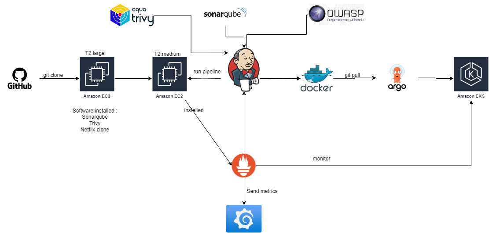

# DevSecOps Pipeline Project 

## Overview

This project implements a comprehensive DevSecOps pipeline utilizing AWS EC2 instances to streamline the continuous integration and deployment (CI/CD) process with an emphasis on security and monitoring. The pipeline is designed to detect security issues early in the development cycle, ensuring a robust and secure application.

### Infrastructure

The setup consists of two AWS EC2 instances configured as follows:

- **Instance 1**: Hosts SonarQube, Trivy, and the Netflix coding standard checker for static code analysis and security scanning.
- **Instance 2**: Hosts Jenkins for CI/CD pipelines, Prometheus for monitoring, and Grafana for visualization.

### Pipeline Workflow

1. **Code Analysis and Security Scanning**: The Jenkins pipeline is configured with plugins for SonarQube, Trivy, and OWASP Dependency-Check to analyze the source code for security vulnerabilities and code quality issues.

2. **Containerization**: Upon successful analysis and scanning, the code is containerized and pushed to Docker Hub as a Docker image.

### Future Enhancements

- **GitOps with Argo CD**: Planning to integrate GitOps practices using Argo CD to automate the deployment of applications to Kubernetes clusters hosted on the AWS cloud. This will further streamline the deployment process, enabling automatic syncing of applications with their desired state defined in Git repositories.

### Architecture Diagram

*The diagram visualizes the workflow and integration of tools within the pipeline.*

### Tools and Technologies

- **Jenkins**: Automation server for CI/CD pipelines.
- **SonarQube**: Continuous inspection of code quality.
- **Trivy**: Vulnerability scanner for containers and other artifacts.
- **OWASP Dependency-Check**: Detects publicly disclosed vulnerabilities in project dependencies.
- **Prometheus**: Monitoring system and time series database.
- **Grafana**: Analytic and monitoring platform.
- **Docker Hub**: Service for managing Docker images.
- **Argo CD**: Declarative, GitOps continuous delivery tool for Kubernetes.

### Getting Started

To replicate this pipeline:

1. **Set up AWS EC2 Instances**: Launch two EC2 instances in your AWS account and configure security groups to allow necessary traffic.

2. **Install Required Tools**: Follow the installation guides for [Jenkins](https://www.jenkins.io/doc/book/installing/), [SonarQube](https://docs.sonarqube.org/latest/setup/install-server/), [Trivy](https://aquasecurity.github.io/trivy/v0.18.3/getting-started/installation/), [Prometheus](https://prometheus.io/docs/prometheus/latest/installation/), [Grafana](https://grafana.com/docs/grafana/latest/installation/), and [Argo CD](https://argo-cd.readthedocs.io/en/stable/getting_started/).

3. **Configure Jenkins Pipeline**: Create a new pipeline in Jenkins and configure it with the necessary plugins for SonarQube, Trivy, and OWASP Dependency-Check.

4. **Deploy Monitoring Stack**: Set up Prometheus and Grafana on the second instance for monitoring the pipeline and the deployed application.

5. **Integrate Docker Hub**: Configure Jenkins to build Docker images and push them to Docker Hub upon successful builds.

6. **Plan for GitOps**: Explore Argo CD documentation to understand how to deploy applications from Git repositories to Kubernetes clusters.

### Contributing

Contributions to improve the pipeline or add new features are welcome. Please feel free to fork the repository, make changes, and submit pull requests.

---

*This README provides a high-level overview of the DevSecOps pipeline project. For detailed setup instructions and configurations, refer to the official documentation of each tool used in the pipeline.*
